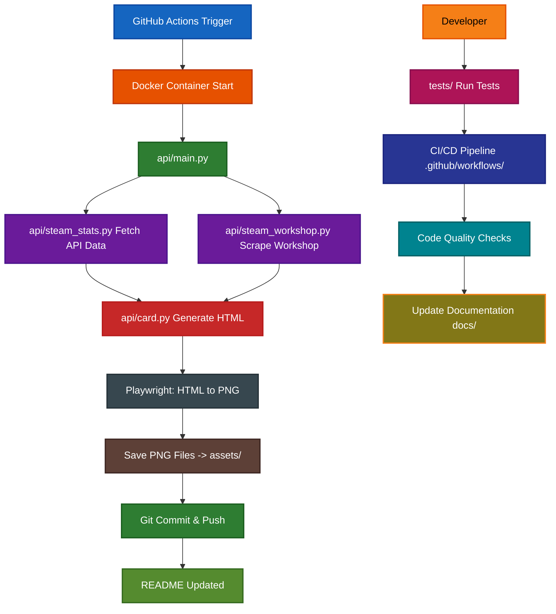

# Project Layout :material-file-tree:

This page explains the complete structure of the Steam Stats repository and the purpose of each file and directory.

## Repository Structure :octicons-repo-24:

```sh
Steam-Stats/
├── .dockerignore                          # Docker build exclusions
├── .env                                   # Local environment variables (not committed)
├── .env.example                           # Template for environment variables
├── .gitignore                             # Git exclusions
├── .pre-commit-config.yaml                # Pre-commit hook configuration
├── action.yml                             # GitHub Action definition
├── CHANGELOG.md                           # Version history and release notes
├── Dockerfile                             # Container image definition
├── LICENSE                                # Project license (GPLv3)
├── mkdocs.yml                             # Documentation configuration
├── pyproject.toml                         # Modern Python project configuration
├── pytest.ini                             # Pytest configuration
├── README.md                              # Project overview and quick start
├── requirements.txt                       # Python dependencies
├── .github/                               # GitHub-specific configuration
│   ├── codecov.yml                        # Code coverage configuration
│   ├── CODEOWNERS                         # Code review assignments
│   ├── CODE_OF_CONDUCT.md                 # Community guidelines
│   ├── Commits.md                         # Commit message conventions
│   ├── CONTRIBUTING.md                    # Contribution guidelines
│   ├── dependabot.yml                     # Automated dependency updates
│   ├── FUNDING.yml                        # GitHub Sponsors configuration
│   ├── PULL_REQUEST_TEMPLATE.md           # PR template
│   ├── SECURITY.md                        # Security policy and reporting
│   ├── ISSUE_TEMPLATE/                    # Issue template forms
│   │   ├── bug-report.yml
│   │   ├── config.yml
│   │   ├── documentation.yml
│   │   ├── example-submission.yml
│   │   ├── feature-request.yml
│   │   ├── help-wanted.yml
│   │   └── question.yml
│   └── workflows/                         # GitHub Actions workflows
│       ├── bandit.yml                     # Security vulnerability scanning
│       ├── codeql.yml                     # Code quality and security analysis
│       ├── coverage.yml                   # Code coverage reporting
│       ├── dependency-review.yml          # Dependency security review
│       ├── release.yml                    # Automated release process
│       ├── scorecard.yml                  # OpenSSF security scorecard
│       └── steam-stats.yml                # Main CI/CD pipeline for testing
├── api/                                   # Core Python application
│   ├── card.py                            # HTML/PNG generation and Playwright integration
│   ├── main.py                            # Application entry point and workflow orchestration
│   ├── steam_stats.py                     # Steam Web API integration and data fetching
│   ├── steam_workshop.py                  # Workshop scraping logic (no official API)
│   ├── utils.py                           # Utility functions and helper methods
│   └── __init__.py                        # Python package initialization
├── assets/                                # Generated files and styling
│   ├── recently_played_games(linear).png  # Linear scale example
│   ├── recently_played_games(log).png     # Logarithmic scale example
│   ├── recently_played_games.html         # HTML template for recent games
│   ├── recently_played_games.png          # Generated recent games card
│   ├── steam_summary.html                 # HTML template for user summary
│   ├── steam_summary.png                  # Generated user summary card
│   ├── steam_workshop_stats.html          # HTML template for workshop stats
│   ├── steam_workshop_stats.png           # Generated workshop stats card
│   └── style.css                          # CSS styling for all cards
├── docs/                                  # MkDocs documentation
│   ├── changelog.md                       # Changelog page for documentation
│   ├── index.md                           # Documentation homepage
│   ├── license.md                         # License page for documentation
│   ├── setup.md                           # Quick start guide
│   ├── assets/                            # Documentation images and screenshots
│   ├── developer-guide/                   # Contributing and development guides
│   │   ├── contributing.md
│   │   ├── index.md
│   │   ├── local-development.md
│   │   ├── project-layout.md
│   │   └── testing.md
│   ├── examples/                          # Real-world usage examples
│   │   ├── contribute-examples.md
│   │   └── index.md
│   ├── getting-started/                   # Setup and configuration guides
│   │   ├── github-action.md
│   │   ├── index.md
│   │   ├── prerequisites.md
│   │   ├── readme-integration.md
│   │   ├── steam-id.md
│   │   ├── steam-web-api.md
│   │   └── verification.md
│   ├── reference/                         # API documentation
│   │   ├── card.md
│   │   ├── index.md
│   │   ├── main.md
│   │   ├── steam-stats.md
│   │   ├── steam-workshop.md
│   │   └── utils.md
│   └── user-guide/                        # Configuration and usage guides
│       ├── cards-overview.md
│       ├── config.md
│       ├── index.md
│       ├── scheduling.md
│       └── troubleshooting.md
├── templates/                             # Jinja2 templates for automation
│   ├── CHANGELOG.md.j2                    # Changelog generation template
│   ├── release_notes.md.j2                # Release notes template
│   └── components/                        # Reusable template components
│       ├── changelog_header.md.j2
│       ├── changelog_init.md.j2
│       ├── changelog_update.md.j2
│       └── changes.md.j2
└── tests/                                 # Test suite
    ├── test_card.py                       # Card generation and PNG tests
    ├── test_main.py                       # Main workflow integration tests
    ├── test_steam_stats.py                # Steam API integration tests
    ├── test_steam_workshop.py             # Workshop scraping tests
    ├── test_utils.py                      # Utility function tests
    └── __init__.py                        # Test package initialization
```

## File and Directory Explanations :octicons-file-24:

### Core Configuration Files :material-file-cog:

| File              | Purpose                        | Key Contents                                               |
|-------------------|--------------------------------|------------------------------------------------------------|
| `action.yml`      | **GitHub Action definition**   | Inputs, outputs, Docker image configuration for marketplace|
| `Dockerfile`      | **Container definition**       | Build image with Playwright, Python dependencies           |
| `pyproject.toml`  | **Modern Python configuration**| Project metadata, dependencies, build settings             |
| `requirements.txt`| **Python dependencies**        | `PyGithub`, `playwright`, `python-semantic-release`, etc.  |
| `pytest.ini`      | **Test configuration**         | Pytest options & default fixture loop scope                |
| `mkdocs.yml`      | **Documentation config**       | MkDocs Material theme, navigation, plugins                 |

### Application Core :octicons-code-24:

| File/Directory         | Purpose                    | Key Contents                                           |
|------------------------|----------------------------|--------------------------------------------------------|
| `api/main.py`          | **Application entry point**| Orchestrates workflow from API calls to file generation|
| `api/steam_stats.py`   | **Steam API Integration**  | Player summaries, recent games, API error handling     |
| `api/steam_workshop.py`| **Workshop Web Scraping**  | Web scraping for workshop stats *(no official API)*    |
| `api/card.py`          | **Card generation**        | HTML templates, Playwright PNG conversion              |
| `api/utils.py`         | **Utilities**              | Credential handling, file operations, helper functions |

### GitHub Integration :material-github:

| File/Directory           | Purpose               | Key Contents                                           |
|--------------------------|-----------------------|--------------------------------------------------------|
| `.github/workflows/`     | **CI/CD automation**  | Testing, security scanning, releases, coverage         |
| `.github/ISSUE_TEMPLATE/`| **Issue forms**       | Structured templates for bugs, features, docs, examples|
| `CODEOWNERS`             | **Code review**       | Automatic reviewer assignment for different areas      |
| `SECURITY.md`            | **Security policy**   | Vulnerability reporting and security guidelines        |
| `CONTRIBUTING.md`        | **Contribution guide**| Quick contributor onboarding and standards             |

### Asset Management :material-image:

| File/Directory    | Purpose            | Key Contents                                    |
|-------------------|--------------------|-------------------------------------------------|
| `assets/`         | **Generated files**| PNG cards, HTML templates, CSS styling          |
| `assets/style.css`| **Card styling**   | CSS for fonts, colors, layout, responsive design|
| `assets/*.html`   | **HTML templates** | Rendered templates before PNG conversion        |
| `assets/*.png`    | **Generated cards**| Final PNG outputs for GitHub Readme             |

### Documentation System :material-book:

| File/Directory         | Purpose          | Key Contents                                 |
|------------------------|------------------|----------------------------------------------|
| `docs/getting-started/`| **Setup guides** | Prerequisites, API keys, workflow setup      |
| `docs/user-guide/`     | **Usage guides** | Configuration, troubleshooting, customization|
| `docs/developer-guide/`| **Development**  | Contributing, testing, project layout        |
| `docs/reference/`      | **API Docs**     | Auto-generated from code docstrings          |
| `docs/examples/`       | **Real examples**| Community showcase, contribution guide       |

### Testing Infrastructure :material-test-tube:

| File/Directory                  | Purpose               | Key Contents                     |
|---------------------------------|-----------------------|----------------------------------|
| `tests/`                        | **Test suite**        | Unit Tests                       |
| `tests/test_*.py`               | **Test modules**      | Tests for each major component   |
| `pytest.ini`                    | **Test configuration**| Coverage settings, test discovery|
| `.github/workflows/coverage.yml`| **Coverage CI**       | Automated coverage reporting     |

### Automation Templates :material-auto-fix:

| File/Directory           | Purpose                | Key Contents                       |
|--------------------------|------------------------|------------------------------------|
| `templates/`             | **Jinja2 templates**   | Changelog generation, release notes|
| `templates/components/`  | **Reusable components**| Template partials for automation   |
| `.pre-commit-config.yaml`| **Code quality**       | Automated formatting, linting hooks|

## Architecture Flow :octicons-workflow-24:



## Key Dependencies :material-package-check:

### Core Runtime Dependencies :octicons-package-dependents-24:

| Dependency     | Purpose                              | Used In                | Current Version |
|----------------|--------------------------------------|------------------------|-----------------|
| `bs4`          | HTML parsing for workshop scraping   | `api/steam_workshop.py`| `0.0.2`         |
| `playwright`   | Browser automation for PNG generation| `api/card.py`          | `1.55.0`        |
| `PyGithub`     | GitHub API interactions              | `api/main.py`          | `2.7.0`         |
| `DateTime`     | Date/time handling                   | Various modules        | `5.5`           |
| `python-dotenv`| Environment variable loading         | Local development      | `1.1.1`         |

### Development & Testing Dependencies :material-ab-testing:

| Category         | Dependencies                                                      | Purpose                            |
|------------------|-------------------------------------------------------------------|------------------------------------|
| **Testing**      | `pytest-asyncio`, `pytest-cov`, `pytest-mock`, `requests-mock`    | Unit testing, coverage, mocking    |
| **Documentation**| `mkdocs-material`, `mkdocs-mermaid2-plugin`, `mkdocstrings-python`| Documentation generation           |
| **Code Quality** | `bandit`, `pylint`                                                | Security scanning, code linting    |
| **Release**      | `python-semantic-release`, `twine`                                | Automated releases, PyPI publishing|

### System Dependencies :octicons-package-dependencies-24:

| Requirement| Purpose                                   |
|------------|-------------------------------------------|
| Python 3.9+| **Core Runtime**                          |
| Docker     | **Containerization and CI/CD**            |
| Git        | **Version Control**                       |
| Chromium   | **Playwright Chromium for PNG generation**|

## Development Entry Points :material-location-enter:

| Task                      | Start Here             | Key Files                              |
|---------------------------|------------------------|----------------------------------------|
| **Add Steam API endpoint**| `api/steam_stats.py`   | Add function, update `api/main.py`     |
| **Modify card appearance**| `assets/style.css`     | CSS styling, test in `api/card.py`     |
| **Add new card type**     | `api/card.py`          | HTML generation, PNG conversion        |
| **Fix workshop scraping** | `api/steam_workshop.py`| BeautifulSoup selectors, error handling|
| **Add tests**             | `tests/`               | Create corresponding test file         |
| **Update documentation**  | `docs/`                | Relevant section, update `mkdocs.yml`  |
| **Modify GitHub Actions** | `.github/workflows/`   | Update CI/CD pipeline                  |

## Local Development Tips :material-folder-wrench-outline:

1. **API Testing**: Use `python -m api.main` with `.env` file for local runs
2. **Prevent Auto-Commit** (**IMPORTANT**): Comment out the below GitHub commit lines in `api/main.py` before testing locally:
    ```py
    files_to_update = collect_files_to_update(current_readme, original_readme)

    if files_to_update:
        if commit_to_github(repo, files_to_update):
            logger.info("Successfully committed to GitHub")
        else:
            logger.error("Failed to commit changes to GitHub")
    else:
        logger.info("No changes to commit")
    ```
3. **Card Preview**: After running `python -m api.main`, HTML and PNG files are automatically generated in `assets/` folder. Open the HTML files in browser to preview and PNG files to compare and see if the changes reflected correctly
4. **Workshop Debugging**: Print scraped HTML to debug selector changes on Steam's site
5. **Docker Testing**: Use `docker build .` to test containerized builds locally
6. **Documentation**: Use `mkdocs serve` for live documentation preview
7. **Testing**: Use `pytest --cov` to ensure code coverage meets standards

!!! warning "Avoid Accidental Commits"
    Always comment out the GitHub commit code in `main()` function when testing locally to prevent unintended pushes to your repository.

---

*Next: [Local Development Setup](local-development.md) to configure your environment*
