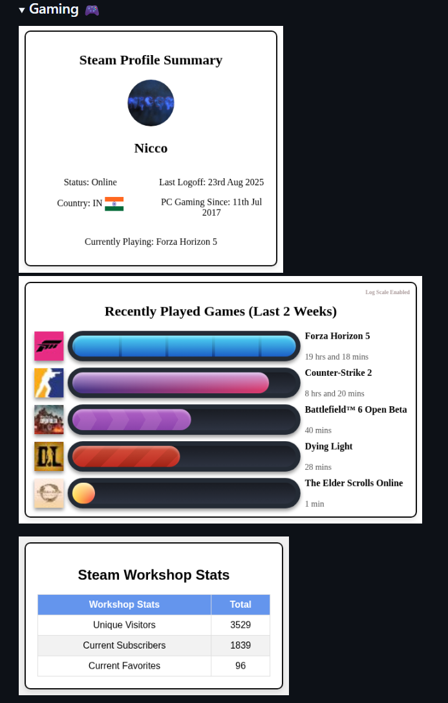

# Examples :material-draw-pen:

### Gaming Developer Profile
Real-world example from the [Author's](https://github.com/Nicconike) profile:



> *User Summary and Recently Played Games cards as rendered in a GitHub profile README*

### Minimal Setup
Basic implementation for casual gamers:

```yml
name: Steam Stats
on:
  schedule:
    - cron: "0 0 * * 1" # Weekly updates
jobs:
  steam-stats:
    name: Steam Stats
    runs-on: ubuntu-latest
    steps:
    - name: Steam Stats
        uses: nicconike/steam-stats@master
        with:
          STEAM_API_KEY: ${{ secrets.STEAM_API_KEY }}
          STEAM_ID: ${{ vars.STEAM_ID }}
          STEAM_CUSTOM_ID: ${{ vars.STEAM_CUSTOM_ID }}
```

### Advanced Configuration
For content creators with workshop items:

```yml
name: Steam Stats
on:
  schedule:
    - cron: "0 0 * * 1" # Weekly updates
jobs:
  steam-stats:
    name: Steam Stats
    runs-on: ubuntu-latest
    steps:
    - name: Steam Stats
        uses: nicconike/steam-stats@master
        with:
          STEAM_API_KEY: ${{ secrets.STEAM_API_KEY }}
          STEAM_ID: ${{ vars.STEAM_ID }}
          STEAM_CUSTOM_ID: ${{ vars.STEAM_CUSTOM_ID }}
          WORKSHOP_STATS: True # Optional
          LOG_SCALE: True # Optional
```

### Contributing Your Example
Want to see your profile featured here? Share your integration by following the guide on the [next page](contribute-examples.md)!

---

*Return to the [Getting Started](../getting-started/index.md) or [User Guide](../user-guide/index.md).*
