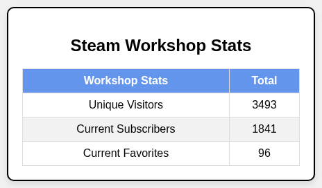

# Getting Started

Welcome to Steam Stats! If you've just completed the [installation](../setup.md), you're ready to understand how Steam Stats works and what you can do with it.

## What You've Just Set Up

Steam Stats is now configured to automatically fetch your Steam data and generate cards for your GitHub profile. Here's what happens behind the scenes:

### The Process
1. **Scheduled Trigger** - Your GitHub Action runs every Monday at midnight IST (default)
2. **Data Fetching** - Steam Stats connects to Steam's API using your credentials
3. **Card Generation** - Creates PNG cards with your gaming statistics
4. **README Update** - Automatically embeds cards between your comment markers

### What Gets Created
- **Steam User Card** - Profile summary with image and account details
- **Recently Played Games** - Last 2 weeks of gaming activity with playtime and game logo
- **Workshop Stats** *(Optional)* - Aggregated statistics from your created content

## Verify Your Setup

### Check Your First Run

After running the workflow manually or waiting for the scheduled run:

1. **Visit your repository** - Your README should now display the generated cards
2. **Check for new files** - PNG files are created in your repository
3. **Review the workflow logs** - Ensure no errors occurred during generation

### What Success Looks Like

Your README will show cards similar to these examples:


*When Log Scale is Enabled*



## Understanding Your Cards

### Steam User Summary
- **Profile Information** - Username, avatar, and Currently Playing
- **Account Status** - Online state and profile visibility
- **Others** - Account creation date and country

### Recently Played Games
- **Game Selection** - Shows games played in the last 14 days
- **Playtime Data** - Hours played with the game name
- **Visual Design** - Game artwork and clean layout

### Workshop Statistics *(If Enabled)*
- **Subscriber Count** - Total subscribers across all your items
- **Favorites** - Total number of users who favorited your content
- **Unique Visitors** - Total unique visitors to your workshop items

## Customization Options

### Update Frequency
Your Steam Stats currently update every Monday. You can modify this schedule:

- **Daily updates** - For active streamers or content creators
- **Weekly updates** - Balanced approach (current default)
- **Manual only** - Update on-demand when needed

[Learn more about scheduling](../user-guide/scheduling.md)

### Card Positioning
You control where cards appear by placing comment markers in your README:

- **Above or below** other sections
- **In specific order** (Steam Stats must come before Workshop)
- **With custom spacing** and surrounding content

### Workshop Integration
Workshop cards are entirely optional:

- **Remove Workshop comments** if you don't create content
- **Keep comments but leave empty** if you plan to add content later
- **Add Workshop content** to showcase your creations

## Project Structure & Files

Steam Stats creates and manages several files in your repository:
```yml
your-repository/
├── .github/
├────── workflows/
├──────────── steam-stats.yml # GitHub Action workflow
├── README.md # Your profile with embedded cards
├── assets/
├────── steam_summary.png # Generated user summary card
├────── recently_played_games.png # Generated recent games card
└────── steam_workshop_stats.png # Generated workshop card (optional)
```

For developers interested in the complete project structure, see the [project layout documentation](../developer-guide/project-layout.md) for Steam Stats.

## What's Next?

Now that Steam Stats is working, here are your next steps based on what you want to accomplish:

### **New Users** *(Just want it to work)*
- [Understand your cards](../user-guide/cards-overview.md) - Learn what each card displays
- [Basic troubleshooting](../user-guide/troubleshooting.md) - Solve common issues

### **Customizers** *(Want to modify behavior)*
- [Change update schedule](../user-guide/scheduling.md) - Modify when stats refresh
- [Workflow configuration](../user-guide/config.md) - Advanced GitHub Actions settings

### **Explorers** *(Want to see possibilities)*
- [View examples](../examples/index.md) - See how others use Steam Stats
- [Community showcase](../examples/contribute-examples.md) - Real world implementations

### **Contributors** *(Want to help improve)*
- [Development guide](../developer-guide/index.md) - Set up local development
- [Contributing guidelines](../developer-guide/contributing.md) - How to contribute

## Detailed Getting Started Topics

This section covers specific aspects of getting started with Steam Stats:

<div class="grid cards" markdown>

-   [**Prerequisites**](prerequisites.md)

    ---

    System requirements, account setup and what you need before starting

-   [**Steam API Setup**](steam-web-api.md)

    ---

    Detailed guide to obtaining and configuring your Steam Web API key

-   [**GitHub Action Setup**](github-action.md)

    ---

    Deep dive into workflow configuration and GitHub Actions integration

-   [**README Integration**](readme-integration.md)

    ---

    Advanced comment placement, formatting and README best practices

</div>

## Common First-Time Questions

### "When will I see my first stats?"
- **Manual trigger**: Results appear within 2-3 minutes
- **Scheduled run**: Next Monday at midnight IST (default)
- **GitHub Actions**: Check the Actions tab for workflow status

### "What if I don't have recent gaming activity?"
- Cards will still generate with your profile information
- Recent games card may show "No recent activity"
- Workshop card only appears if you have published content

### "Can I use this with multiple Steam accounts?"
- Currently supports one Steam account per repository
- You can set up separate repositories for different accounts
- Enterprise use cases can be discussed in GitHub issues

### "What data is collected and stored?"
- Your Steam Web API key and IDs stay in your own repository secrets never in code or logs.
- Steam Stats fetches public data from the Steam API at build time and does not store it anywhere after the job ends.
- The only permanent files it adds are the generated PNG cards committed to your repository.

## Need Help?

If you encounter issues or have questions:

1. **Check specific guides** - Use the detailed topic pages above
2. **Review troubleshooting** - [Common solutions](../user-guide/troubleshooting.md)
3. **Search existing issues** - [GitHub Issues](https://github.com/Nicconike/Steam-Stats/issues)
4. **Ask the community** - Open a new issue for help

---

**Congratulations!** You're now ready to showcase your Steam gaming statistics alongside your code contributions. Your GitHub profile just got a lot more interesting!
