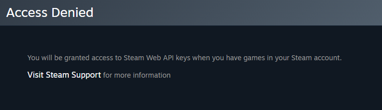

# Prerequisites

Before setting up Steam Stats, ensure you have the necessary accounts, permissions and basic knowledge to complete the installation successfully.

## Required Accounts

### GitHub Account
- **Personal or organization account** with repository creation permissions
- **Repository for your profile README** (typically named `username/username`)
- **Basic familiarity** with GitHub repositories, Actions and Secrets

!!! tip "GitHub Profile Repository"

    Your profile README appears when you create a repository with the same name as your username. For example, if your username is `nicconike`, create a repository called `nicconike/nicconike`.

### Steam Account
- **Active Steam account** with gaming activity
- **Minimum $5 spent** on Steam purchases (required for API key)
- **Profile visibility** set to Public (recommended) or Friends Only

!!! warning "Limited User Accounts"
    To obtain a Steam Web API key, your Steam account must have made at least one purchase (min $5). This is a Steam requirement for API access, not a limitation of Steam Stats.

    If you try registering for API Key as a limited user account then you will get below access denied message

    

    Steam Limited User Accounts cannot access many features including API key generation. You need a full Steam account with purchase history.

    You can read Steam's Official Doc regarding [Limited User Accounts](https://help.steampowered.com/en/faqs/view/71D3-35C2-AD96-AA3A).

## Technical Requirements

### GitHub Actions Knowledge
You should understand:

- **Basic YAML syntax** for workflow files
- **Repository secrets** and how to add them
- **GitHub Actions workflow** execution and logs
- **Markdown formatting** for README files

### Steam Profile Setup
Your Steam profile should have:

- **Some gaming activity** (owned games, playtime history)
- **Public profile** or Friends Only visibility
- **Custom Steam ID** (needed for Workshop stats)

## Account Permissions

### GitHub Repository
- **Admin or write access** to your profile repository
- **Actions enabled** for the repository
- **Ability to add secrets** to the repository

### Steam Account
- **API key generation rights** (requires purchase history)
- **Profile data access** through your own API key
- **Workshop content** (optional, only if using Workshop stats)

## Optional Components

### Steam Workshop
Only needed if you want Workshop statistics:

- **Published Steam Workshop items** (maps, mods, guides, etc.)
- **Custom Steam ID** set in your profile
- **Workshop content** with some activity (visitors, subscribers, favorites)

### Custom Scheduling
If you want non-default update frequency:

- **Understanding of cron expressions** for scheduling
- **GitHub Actions usage limits** awareness
- **Repository activity** considerations

## System Dependencies

All technical dependencies are handled automatically:

- **Docker runtime** - Provided by GitHub Actions
- **Python environment** - Included in Steam Stats container
- **Steam API libraries** - Pre-installed in the action
- **Image generation tools** - Built into the container

!!! info "No Local Installation Required"

    Steam Stats runs entirely in GitHub Actions. You don't need to install Python, Docker or any libraries on your local machine.

## Knowledge Prerequisites

Before you begin, you should be comfortable with:

- Creating and editing files in GitHub repositories
- Basic Markdown syntax for README files
- Adding and managing repository secrets in GitHub
- Running and monitoring GitHub Actions workflows

## Pre-Setup Checklist

Before proceeding with installation, verify you have:

- [ ] **GitHub account** with repository access
- [ ] **Steam account** with purchase history ($5+ spent)
- [ ] **Profile repository** created (username/username)
- [ ] **README.md file** exists in your profile repository
- [ ] **Steam profile** set to Public or Friends Only
- [ ] **Basic understanding** of GitHub Actions and Markdown

### Optional Checklist (For Workshop Stats)
- [ ] **Steam Workshop items** published
- [ ] **Custom Steam ID** configured in Steam profile
- [ ] **Workshop activity** (subscribers, favorites or views)

## Common Prerequisite Issues

### "I can't get a Steam API key"
- **Solution**: Your account needs at least $5 in Steam purchases
- **Alternative**: Gift cards, game purchases, or DLC count toward this limit
- **Timeframe**: Purchase history must be established (not immediate)

### "My GitHub repository doesn't show in my profile"
- **Solution**: Repository must be named exactly like your username
- **Visibility**: Repository must be public to display on your profile
- **README**: Must contain a README.md file in the root directory

### "I don't understand GitHub Actions"
- **Solution**: Review GitHub's [Actions documentation](https://docs.github.com/actions)
- **Alternative**: Follow the setup guide step-by-step without deep understanding
- **Learning**: GitHub Actions knowledge will improve with practice

### "My Steam profile is private"
- **Solution**: Set profile to Public or Friends Only in Steam privacy settings
- **Impact**: Private profiles may not provide full data access
- **Note**: Your own API key can access your private data, but public is recommended

## Ready to Continue?

Once you've verified all prerequisites:

- **Need complete walkthrough**: Start with [Installation Guide](../setup.md)
- **Just want overview**: Return to [Getting Started](index.md)

## Need Help with Prerequisites?

### GitHub Issues
- **Account problems**: Contact [GitHub Support](https://support.github.com/) directly
- **Repository questions**: Check GitHub's repository [documentation](https://docs.github.com/en/enterprise-cloud@latest/repositories/creating-and-managing-repositories)
- **Actions limitations**: Review GitHub Actions [usage limits](https://docs.github.com/en/actions/concepts/billing-and-usage?versionId=free-pro-team%40latest&productId=actions&restPage=how-tos%2Ctroubleshoot-workflows#github-actions-usage-metrics)

### Steam Issues
- **API Key problems**: Contact [Steam Support](https://help.steampowered.com/en/)
- **Account limitations**: Review Steam's [Limited User Account policy](https://help.steampowered.com/en/faqs/view/71D3-35C2-AD96-AA3A)
- **Profile settings**: Check Steam's privacy [documentation](https://store.steampowered.com/privacy_agreement/)

### Community Support
- **General questions**: Open an issue in the [Steam Stats repository](https://github.com/Nicconike/Steam-Stats/issues)
- **Setup help**: Ask in GitHub [Discussions](https://github.com/Nicconike/Steam-Stats/discussions)
- **Bug reports**: Use the issue templates provided in [GitHub Issues](https://github.com/Nicconike/Steam-Stats/issues) while creating the bug report

---

Meeting these prerequisites ensures a smooth Steam Stats installation experience. Take the time to verify each requirement before proceeding to avoid setup complications.
