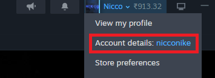
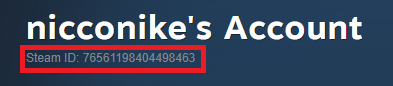
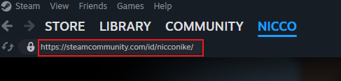
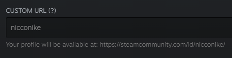
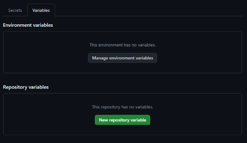

# Steam IDs :fontawesome-solid-id-card:

## What is a Steam ID :material-lightbulb-question:

Your Steam ID is a unique 17-digit number that identifies your Steam account. Steam Stats needs this to fetch your specific gaming data.

- **SteamID64**: a 17-digit numeric ID
- **Custom Steam ID**: an alphanumeric URL slug (for Workshop stats)

## Find Your Steam ID :material-account-search:

### Method 1: Through Steam Client (Recommended)

1. **Open Steam** on your computer and ensure you're logged in
2. **Click your username** in the top right corner of the Steam client
3. **Click "Account details"** from the dropdown menu
    

4. **Copy your Steam ID** from the account page:
    - Look for "[username]'s Account" at the top
    - Your 17-digit Steam ID will be displayed below it
    - Double Click or manually select the number to copy

    

### Method 2: Through Web Browser

1. **Go to Steam's website**: [Steam](https://store.steampowered.com/)
2. **Log in** to your Steam account
3. **Click your username** in the top right corner
4. **Select "View my profile"** from the dropdown
5. **Copy the numbers** from the URL address bar after `/profiles/`

Example: `https://steamcommunity.com/profiles/76561198404498463/` :material-arrow-right-bold-outline: Steam ID is `76561198404498463`

---

## What is a Custom Steam ID :material-lightbulb-question:

Your Custom Steam ID is the personalized part of your Steam profile URL (e.g., `/id/yourcustomname/`). This is **required only if you want Workshop stats**.

## Find Your Custom Steam ID :material-account-search:

### How to Find Your Custom ID

**Method 1: From Your Profile URL**

1. **Go to your Steam profile** (in client or browser)
2. **Inspect the URL**:
    - If it reads `/id/<customname>/`, your custom ID is `<customname>`.
    - If it reads `/profiles/<numbers>/`, you have not set a custom ID.

    

3. Copy the `<customname>` portion if present.

**Method 2: Set or Change Your Custom Steam ID**

If you don't have a custom ID but want Workshop stats:

1. In the Steam client or web, go to your profile.
2. Click **Edit Profile**
3. Under **General**, find **Custom URL**.
4. Enter your desired custom ID (alphanumeric, no spaces).
5. Save your changes.
6. Your custom ID now appears in your profile URL at `/id/<customname>/`.

    

!!! warning "Workshop Stats Requirement"

    Custom Steam ID is **required** to generate Workshop statistics.

## Storing Steam IDs in GitHub

### **Add your Steam ID**
- Click "New repository variable"
- **Name**: `STEAM_ID`
- **Value**: Paste your 17-digit Steam ID
- Click "Add variable"

### **Add your Steam Custom ID**
- Click "New repository variable" again
- **Name**: `STEAM_CUSTOM_ID`
- **Value**: Paste your Steam custom name
- Click "Add variable"

