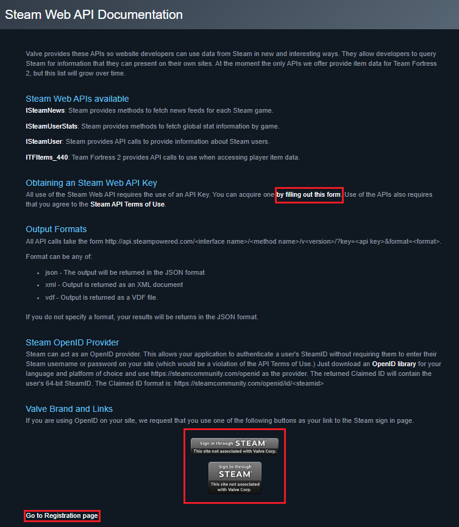
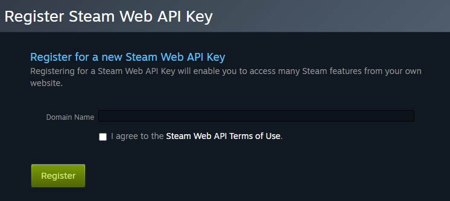
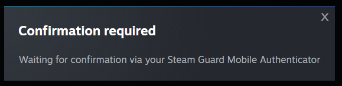
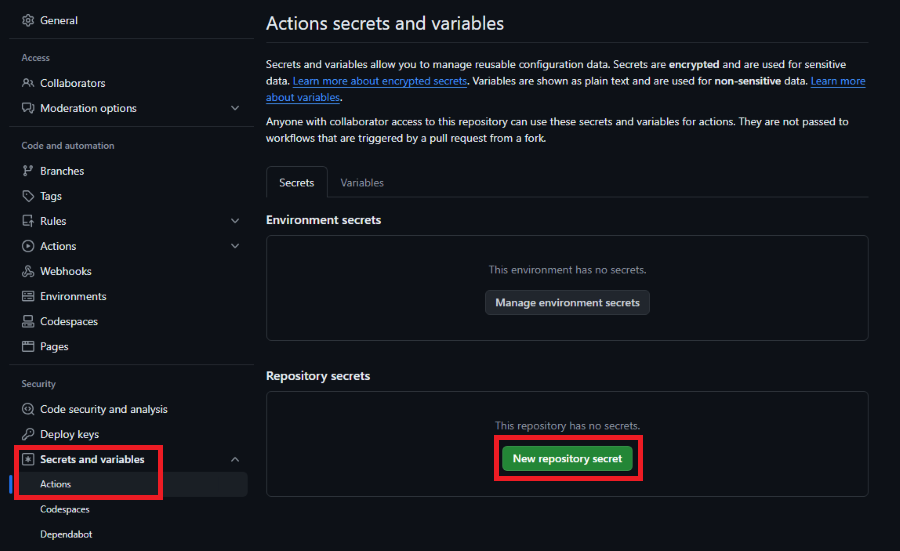

# Steam Web API Key

## What is a Steam Web API Key?

A Steam Web API Key is a unique identifier that allows applications to access Steam's public and private data about your account. Steam Stats uses this key to fetch your profile information and recent games.

### Getting Your API Key

1. **Visit the Steam API registration page**: [Steam API Key](https://steamcommunity.com/dev/apikey)
    

2. **Log in** with your Steam account credentials

3. **Fill out the registration form**:
    - **Domain Name**: You can enter any domain name (e.g., `github.com` or your repository URL)
    - **Agreement**: Check "I agree to the [Steam Web API Terms of Use](https://steamcommunity.com/dev/apiterms)"
    

4. **Click Register** to generate your key

5. **Steam Guard Mobile Authenticator**: Approve Steam Guard confirmation if you have enabled the authenticator
    
    

5. **Copy your API key** - This will be a 32-character string that looks like: `ABCDEF1234567890ABCDEF1234567890`

6. **Add the key to your Repo Secrets**:

!!! danger "Keep Your API Key Secret"

    Never share your Steam Web API key publicly or commit it to your repository. Treat it like a password - API abuse can result in your Steam account being restricted.

#### API Key Security Tips

- Store the key in GitHub Secrets (covered in Step 4)
- Never include it directly in your workflow files
- You can revoke and regenerate the key anytime from the same page

### Storing Secrets in GitHub

GitHub Secrets allow you to store sensitive information securely without exposing it in your code.

1. **Go to your repository** on GitHub
2. **Click Settings** tab (next to Code, Issues, Pull requests, etc. on the far-right)
3. **Navigate to Secrets**:
    - In the left sidebar, click "Secrets and variables"
    - Click "Actions"
4. **Add your Steam API Key**:
    - Click "New repository secret"
    - **Name**: `STEAM_API_KEY`
    - **Secret**: Paste your 32-character Steam Web API key
    - Click "Add secret"
    

### Common API Key Issues

| Issue                | Solution                                                      |
|----------------------|---------------------------------------------------------------|
| Access denied        | Upgrade a Limited account by spending $5+ on Steam purchases  |
| Invalid API key      | Verify you copied the full 32-character key correctly         |
| Terms not agreed     | Revisit the registration page and accept the API Terms of Use |
