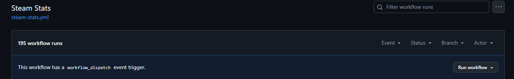

# Test & Verify Your Setup

## Manual Workflow Trigger

1. Go to the **Actions** tab in your repo
2. Select **Steam Stats** workflow
3. Click **Run workflow** -> **Run workflow**
   

## Verify Results

After the workflow completes (usually takes less than 30 secs):

### Successful Execution Logs

In the **Actions** tab, look for these specific log messages indicating success:

```sh
__main__ - INFO - Retrieved Steam User Data
__main__ - INFO - Generated Card for Steam User Data
__main__ - INFO - Retrieved Recently Played Games Data
__main__ - INFO - Generated Card for Recently Played Games
__main__ - INFO - Steam Stats updated
__main__ - INFO - Total Execution Time: X.xxx seconds
```

### Expected Changes in Your Repository

- **README.md** updated with Steam Stats cards between your comment markers
- **PNG files** committed to your repository (by default in `assets/` folder)
- **Workflow run** shows green checkmark in Actions tab

### Additional Logs (If Workshop Enabled)

If you configured Workshop stats, you'll also see:

```sh
__main__ - INFO - Generated Card for Workshop Stats
__main__ - INFO - Workshop Stats updated
```

### What to Check

1. **README Preview** - Visit your repository and verify the cards display correctly
2. **Commit History** - Check for an automated commit with updated PNG files
3. **Actions Status** - Workflow should show **:material-checkbox-marked-circle: Steam Stats** with green checkmark
4. **Log Duration** - Total execution time typically ranges from 15 - 25 seconds

### Signs of Success

- All expected log messages appear
- No ERROR or WARNING messages in logs
- README displays Steam Stats cards
- PNG files are present in your repository
- Workflow completes with green checkmark

### Common Issues

| Issue                | Solution                                                          |
|----------------------|-------------------------------------------------------------------|
| Invalid API key      | Double-check `STEAM_API_KEY` in your GitHub Secrets               |
| User not found       | Verify `STEAM_ID` is correct and 17 digits                        |
| Markers not found    | Ensure comment markers exist in `README.md`                       |
| Wrong comment order  | Place Workshop markers after Steam-Stats markers                  |
| No workshop data     | Check `CUSTOM_STEAM_ID` or remove Workshop markers                |
| Rate limited         | Automatic retry logic will handle rate limits; re-run if needed   |

---

*If you need further help, open an [issue](https://github.com/Nicconike/Steam-Stats/issues) on GitHub!*
