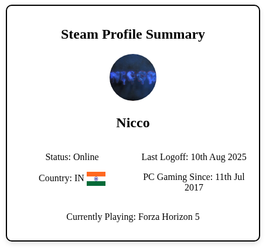
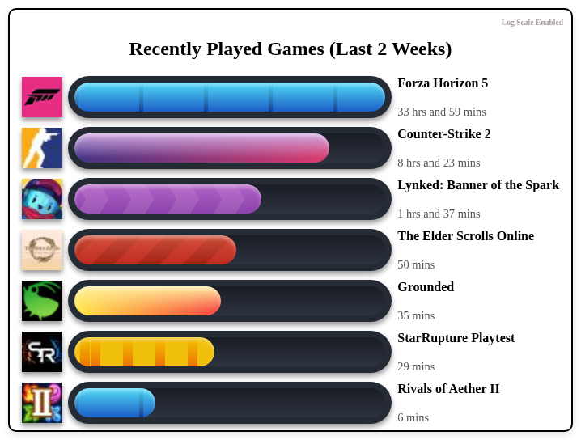
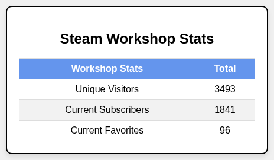

# Steam Stats :material-chart-areaspline:
**Showcase your Steam gaming statistics on GitHub profiles with automated cards**

Steam Stats is a GitHub Action that fetches your Steam user data and generates PNG cards for embedding in your profile README. It supports:

- Steam User Summary (profile info, account status)
- Recently Played Games (last two weeks’ playtime and artwork)
- Steam Workshop Overview (total subscribers, favorites, visitors)

---

## **What It Creates** :material-cards:

### **Steam User Summary Card** :material-account-circle:
A clean card displaying your Steam username, avatar, profile status and more.

### **Recently Played Games Card** :material-gamepad-variant:
A grid of your most recently played titles over the last two weeks, with playtime statistics and game logo.

### **Steam Workshop Card** *(Optional)* :material-tools:
Display aggregated totals for all your Steam Workshop items: subscribers, favorites and unique visitors.

---

## Key Features :material-rocket-launch:

- Docker-powered container for reliable execution
- Native GitHub Actions integration for automated updates
- High-quality PNG output for seamless README embedding
- Official Steam Web API for user data and recent games
- Web scraping for Workshop statistics not exposed by the API
- Configurable schedule via GitHub Actions cron or manual trigger

---

## Quick Start :simple-quicklook:

1. Obtain your **Steam Web API key** from the Steam developer [site](https://steamcommunity.com/dev).
2. Store your Steam API key, Steam ID and Steam Custom ID in GitHub [Repo Secrets](https://docs.github.com/en/actions/how-tos/write-workflows/choose-what-workflows-do/use-secrets) and [Variables](https://docs.github.com/en/actions/how-tos/write-workflows/choose-what-workflows-do/use-variables) respectively.
3. Add a workflow file named `.github/workflows/steam-stats.yml` to your repo with:
    ```yml
    name: Steam Stats
    on:
    workflow_dispatch:
    schedule:
        # Runs every Monday at 12 AM IST (UTC+5:30)
        - cron: "30 18 * * 0"
    jobs:
    steam-stats:
        name: Steam Stats
        runs-on: ubuntu-latest
        steps:
        - name: Steam Stats
            uses: nicconike/steam-stats@master
            with:
            STEAM_API_KEY: ${{ secrets.STEAM_API_KEY }}
            STEAM_ID: ${{ vars.STEAM_ID }}
            STEAM_CUSTOM_ID: ${{ vars.STEAM_CUSTOM_ID }}
            WORKSHOP_STATS: True # Optional
            LOG_SCALE: True # Optional
    ```
4. In your `README.md` file, add these comment pairs where you want the cards inserted:
    1. Steam Stats
    ```md
    <!-- Steam-Stats start -->
    <!-- Steam-Stats end -->
    ```
    2. Steam Workshop Stats *(Optional)*
    ```md
    <!-- Steam-Workshop start -->
    <!-- Steam-Workshop end -->
    ```
---

## Output Examples & Preview :material-camera:

Here’s a sample of what gets generated:

- Steam Profile Summary

    

- Recently Played Games (Linear / Log Scale)

    

- Steam Workshop Stats *(Optional)*

    

---

## Why Steam Stats :material-lightbulb-question:

Steam Stats makes it easy to display your gaming statistics alongside your coding projects. It requires minimal setup, handles errors and rate limits automatically, and keeps your profile up to date with fresh data.

---

## Next Steps :material-walk:

- **Setup Guide:** setup.md
- **Getting Started:** getting-started/index.md
- **User Guide:** user-guide/index.md
- **Examples:** examples/index.md
- **Contributing:** developer-guide/contributing.md

---

*Built by a Gamer who codes (sometimes :fontawesome-solid-grin-tongue-wink:). Star :material-star: the project on GitHub if you find it useful!*
