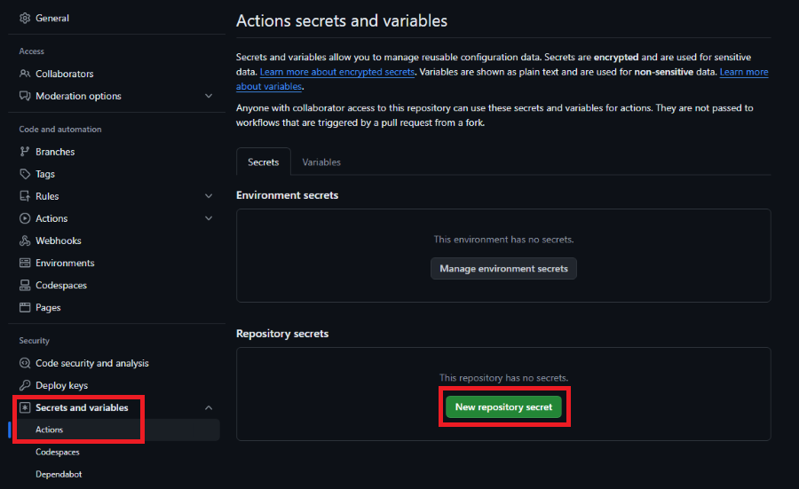

# Action Configuration :simple-githubactions:

Steam Stats requires 3 secrets and supports additional optional flags

## Required Inputs (Secrets) :material-security-network:

| Input            | Type     | Description                         |
|------------------|----------|-------------------------------------|
| `STEAM_API_KEY`  | `string` | Your 32-character Steam Web API key |
| `STEAM_ID`       | `number` | Your 17-digit Steam ID (SteamID64)  |
| `STEAM_CUSTOM_ID`| `string` | Your custom Steam username          |

These must be set as **repository secrets** under Settings :material-arrow-right-bold-outline: Secrets


## Optional Inputs

| Input            | Type      | Default | Description                                         |
|------------------|-----------|---------|-----------------------------------------------------|
| `WORKSHOP_STATS` | `boolean` | `false` | `true` to enable the Workshop statistics card       |
| `LOG_SCALE`      | `boolean` | `false` | `true` to use a log scale for the Recent Games card |

!!! info
    Both boolean inputs accept any of: `true`, `True`, `1`, `t` (and their negatives). But using `True` is recommended

## Pinning a Release :octicons-pin-24:

For stability, it’s a best practice to pin the action to a specific tag or commit hash:

    uses: nicconike/steam-stats@v1.3.2

But please check [Docker Hub](https://hub.docker.com/r/nicconike/steam-stats/tags) for latest tags before using a pinned release or just use master for ease of use

## Example Workflow Snippet :material-draw:

```yml
name: Steam Stats

permissions:
    contents: read

on:
    workflow_dispatch:
    schedule:
        # Runs every Monday at 12 AM IST (UTC+5:30)
        - cron: "30 18 * * 0"

jobs:
    steam-stats:
        name: Steam Stats
        runs-on: ubuntu-latest
        steps:
          - name: Steam Stats
            uses: nicconike/steam-stats@master
            with:
                STEAM_API_KEY:   ${{ secrets.STEAM_API_KEY }}
                STEAM_ID:        ${{ vars.STEAM_ID }}
                STEAM_CUSTOM_ID: ${{ vars.STEAM_CUSTOM_ID }}
                WORKSHOP_STATS:  True # Optional
                LOG_SCALE:       True # Optional
```
